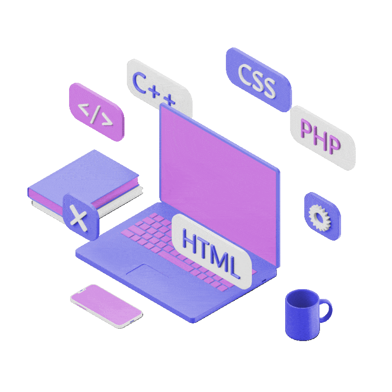
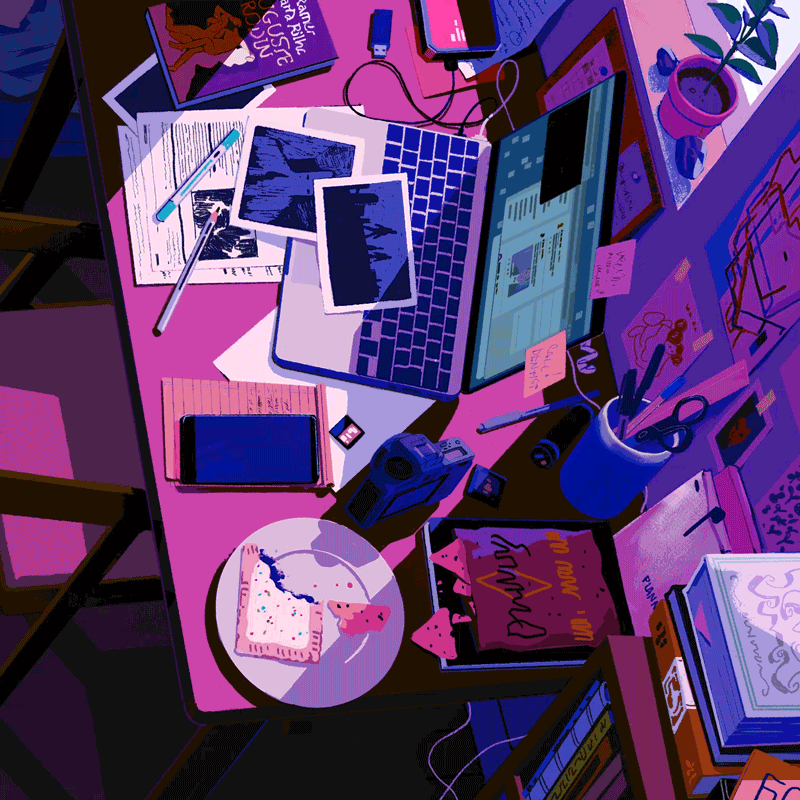
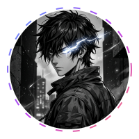

<!-- 
================================================================================
[ SECURITY PROTOCOL ACTIVE — GMPH2007 ORG ]
================================================================================
© 2024-2026 Gerson Misael Pintado Huamán. ALL RIGHTS RESERVED.
ESTE CÓDIGO, DISEÑO Y ESTRUCTURA ESTÁN PROTEGIDOS POR DERECHOS DE AUTOR.
CUALQUIER PLAGIO, COPIA O CLONACIÓN SERÁ REPORTADO DE INMEDIATO A GITHUB.

THIS SOURCE CODE, DESIGN AND STRUCTURE ARE PROTECTED BY COPYRIGHT.
ANY PLAGIARISM, COPY OR CLONING WILL BE IMMEDIATELY REPORTED TO GITHUB TRUST.
================================================================================
-->

  

<!-- Typing SVG -->

  

<!-- Typograssy WELCOME Graph -->

  

  <code style="font-size: 22px; font-weight: bold; color: #58a6ff;">Hi 💎 I'm Misael</code>

<!-- Visitor Counter & Social Badges -->

  

  
  

<!-- Security Shields -->

  
  
  

  

## 👤 Sobre Mí / About Me

<table align="center" border="0" cellpadding="10" cellspacing="0">
  <tr>
    <td valign="top" width="60%">
      

        <strong>ES:</strong> ¡Hola! Soy <strong>Gerson Misael Pintado Huamán</strong>, desarrollador web de Sullana, Piura, Perú 🇵🇪. Me enfoco en crear soluciones digitales de alto impacto que resuelvan problemas reales. Me apasiona automatizar procesos, integrar inteligencia artificial y diseñar interfaces que combinen funcionalidad con una estética premium.
      

      

        🔐 Especialista en <strong>Web Security</strong> y automatizaciones: implemento cifrado <strong>SHA-256</strong>, autenticación <strong>JWT real</strong>, y análisis de sesiones web seguras. Creador de herramientas profesionales de Cookie Checker con verificación criptográfica.
      

      

        <strong>EN:</strong> Hi! I'm <strong>Gerson Misael Pintado Huamán</strong>, a full-stack web developer based in Sullana, Piura, Peru 🇵🇪. I build high-impact digital solutions that solve real-world problems — from AI-integrated platforms to autonomous robotics interfaces.
      

      

        🛡️ Specialist in <strong>Web Security & Automation</strong>: real SHA-256 encryption, JWT authentication, stream cipher databases, and professional Cookie Checker tools. My apps are hardened against XSS, session hijacking, and replay attacks.
      

      

        🌱 <b>Enfoque / Focus:</b> 
         
         
         
         
        
        
      

    </td>
    <td valign="middle" align="center" width="40%">
      
        
      
    </td>
  </tr>
</table>

  

## ⚙️ Tecnologías y Herramientas / Languages and Tools

> Tools and technologies that I have worked with and am interested in.

<table align="center" border="0">
  <tr>
    <td align="center" width="96">
      
       Spring Boot
    </td>
    <td align="center" width="96">
      
       Java
    </td>
    <td align="center" width="96">
      
       REST API
    </td>
    <td align="center" width="96">
      
       PostgreSQL
    </td>
    <td align="center" width="96">
      
       Git
    </td>
    <td align="center" width="96">
      
       GitHub
    </td>
    <td align="center" width="96">
      
       Docker
    </td>
    <td align="center" width="96">
      
       Postman
    </td>
  </tr>
  <tr>
    <td align="center" width="96">
      
       Linux
    </td>
    <td align="center" width="96">
      
       JavaScript
    </td>
    <td align="center" width="96">
      
       HTML5
    </td>
    <td align="center" width="96">
      
       CSS3
    </td>
    <td align="center" width="96">
      
       Bootstrap
    </td>
    <td align="center" width="96">
      
       React
    </td>
    <td align="center" width="96">
      
       Node.js
    </td>
    <td align="center" width="96">
      
       MySQL
    </td>
  </tr>
  <tr>
    <td align="center" width="96">
      
       NPM
    </td>
    <td align="center" width="96">
      
       Markdown
    </td>
    <td align="center" width="96">
      
       WordPress
    </td>
    <td align="center" width="96">
      
       VSCode
    </td>
    <td align="center" width="96">
      
       Figma
    </td>
    <td align="center" width="96">
      
       Trello
    </td>
    <td align="center" width="96">
      
       Firefox
    </td>
    <td align="center" width="96">
      
       Cookie Checker
    </td>
  </tr>
  <tr>
    <td align="center" colspan="8">
       
      
      
      
       <b>Animated Workstations & Learning Setup</b>
    </td>
  </tr>
</table>

  

## 🏆 Logros y Trofeos / Profile Trophies

  <table align="center" border="0" cellpadding="0" cellspacing="0">
    <tr>
      <td valign="middle" align="center">
        
      </td>
      <td valign="middle">
        
      </td>
    </tr>
  </table>

  

## 🦊 Colaboraciones de Código Abierto / Open Source

  

*   **ES:** Colaborador del ecosistema de código abierto de Mozilla, aportando soluciones al entorno de Firefox.
*   **EN:** Contributor to Mozilla's open-source ecosystem, contributing code solutions to the Firefox environment.

  

## 🐍 Contribuciones en Juego / Contribution Snake Game

*La serpiente come mis contribuciones — se actualiza automáticamente cada 6 horas:*

  

  

## 🚀 Proyectos Destacados / Featured Projects

<table align="center" border="0" cellpadding="5" cellspacing="0" width="100%">
  <tr>
    <td align="center" valign="top" width="50%">
      
        
      
      
      
      <h3>🏫 Intranet y Aula Virtual I.E. 14739</h3>
      

        <b>ES:</b> Intranet y aula virtual escolar para la gestión y aprendizaje digital en tiempo real. 
        <b>EN:</b> School intranet and virtual classroom for real-time digital management and learning.
      

      

        
      

    </td>
    <td align="center" valign="top" width="50%">
      
        
      
      
      
      <h3>🛡️ ARGOS - Gestión de Riesgos</h3>
      

        <b>ES:</b> Plataforma autónoma para la prevención y educación frente a riesgos naturales con mapas dinámicos. 
        <b>EN:</b> Autonomous natural disaster prevention and education platform featuring dynamic maps.
      

      

        
      

    </td>
  </tr>
  <tr>
    <td align="center" valign="top" width="50%">
      
        
      
      
      
      <h3>🤖 Discord Moderation Bot</h3>
      

        <b>ES:</b> Bot de moderación para servidores Discord con comandos avanzados de gestión, logs y sistema de sanciones. 
        <b>EN:</b> Advanced Discord moderation bot with management commands, logging and sanctions system.
      

      

        
      

    </td>
    <td align="center" valign="top" width="50%">
      
        
      
      
      
      <h3>⚡ Premium Laravel Template</h3>
      

        <b>ES:</b> Template premium con panel de administración moderno para proyectos Laravel con UI oscura y componentes avanzados. 
        <b>EN:</b> Premium Laravel admin panel template with modern dark UI and advanced components.
      

      

        
      

    </td>
  </tr>
  <tr>
    <td align="center" valign="top" width="50%">
      
        
      
      
      <h3>📡 TrendRadar</h3>
      

        <b>ES:</b> Plataforma de análisis y visualización de tendencias en tiempo real. 
        <b>EN:</b> Real-time trend analysis and visualization platform.
      

      

        
      

    </td>
    <td align="center" valign="top" width="50%">
      
        
      
      
      
      <h3>🧠 ConcienIA</h3>
      

        <b>ES:</b> Proyecto de inteligencia artificial para análisis de conciencia y procesamiento cognitivo. 
        <b>EN:</b> Artificial intelligence project for consciousness analysis and cognitive processing.
      

      

        
      

    </td>
  </tr>
</table>

  

## 📊 Actividad y Estadísticas / Activity & Stats

  

<table align="center" border="0" cellpadding="5" cellspacing="0" width="100%">
  <tr>
    <td align="center" valign="top" width="50%">
      
    </td>
    <td align="center" valign="top" width="50%">
      
    </td>
  </tr>
  <tr>
    <td align="center" colspan="2" valign="top">
       
      
    </td>
  </tr>
</table>

  

## 📬 Contacto / Get in Touch

<table align="center" border="0" cellpadding="10" cellspacing="0" width="100%">
  <tr>
    <td valign="top" width="70%">
      <ul>
        <li>📧 <b>Email:</b> <a href="mailto:misaelpintado7@gmail.com">misaelpintado7@gmail.com</a></li>
        <li>🏢 <b>Empresa / Company:</b> Misael Pintado Empresarial</li>
        <li>📍 <b>Ubicación / Location:</b> Sullana, Piura, Perú 🇵🇪</li>
        <li>🔐 <b>Seguridad / Security:</b> JWT + SHA-256 + Cifrado Simétrico</li>
        <li>⚡ <b>Disponible / Available:</b> Para proyectos y colaboraciones</li>
      </ul>
    </td>
    <td valign="middle" align="center" width="30%">
      
        
      
    </td>
  </tr>
</table>

  

  ⚠️ <b>AVISO DE SEGURIDAD:</b> Este perfil y sus proyectos están protegidos por Copyright © 2024-2026 GMPH2007. Cifrado real SHA-256 | JWT Auth | Protección Anti-Scraping activa.

