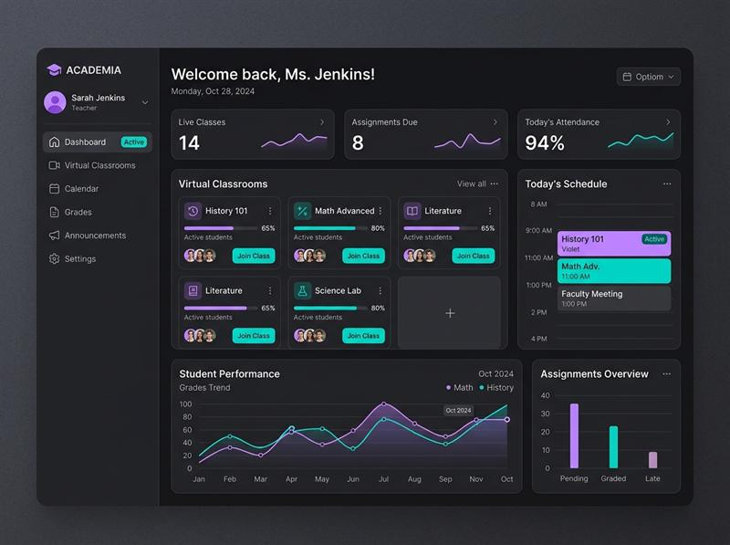
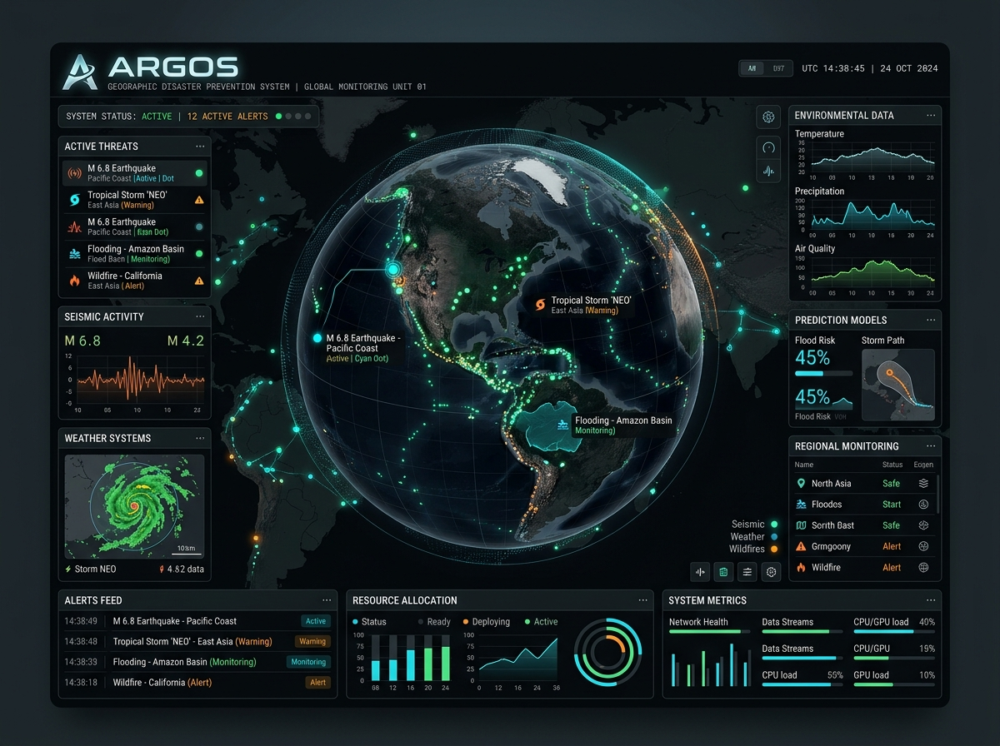

  

<!-- Typing SVG -->

  

<!-- Typograssy WELCOME Graph -->

  

  <code style="font-size: 22px; font-weight: bold; color: #58a6ff;">Hi 💎 I'm Misael</code>

<!-- Visitor Counter & Social Badges -->

  

  
  

  

## 👤 Sobre Mí / About Me

<table align="center" border="0" cellpadding="10" cellspacing="0">
  <tr>
    <td valign="top" width="60%">
      

        <strong>ES:</strong> ¡Hola! Soy <strong>Gerson Misael Pintado Huamán</strong>, desarrollador web de Sullana, Piura, Perú. Me enfoco en crear soluciones digitales de alto impacto que resuelvan problemas reales. Me apasiona automatizar procesos, integrar inteligencia artificial y diseñar interfaces que combinen funcionalidad con una estética premium.
      

      

        <strong>EN:</strong> Hi! I'm <strong>Gerson Misael Pintado Huamán</strong>, a web developer based in Sullana, Piura, Peru. I focus on creating high-impact digital solutions that solve real-world problems. I love automating workflows, integrating artificial intelligence, and designing interfaces that blend function with a premium aesthetic.
      

      

        🌱 <b>Enfoque / Focus:</b> JavaScript | Node.js | HTML5 & CSS3 | IA Integrations
      

    </td>
    <td valign="middle" align="center" width="40%">
      
        
      
    </td>
  </tr>
</table>

  

## 🛠️ Tecnologías y Herramientas / Languages and Tools

Aquí tienes las tecnologías que utilizo y con las que me gusta trabajar:

  

  

## 🏆 Logros y Trofeos / Profile Trophies

  

  

## 🎮 Contribuciones en Juego / Contribution Snake Game

*Este juego de la serpiente se actualiza automáticamente con mis contribuciones diarias:*

  

  

## 🚀 Proyectos Destacados / Featured Projects

<table align="center" border="0" cellpadding="5" cellspacing="0" width="100%">
  <tr>
    <td align="center" valign="top" width="50%">
      
        
      
      
      
      <h3>🏫 Intranet y Aula Virtual I.E. 14739</h3>
      

        <b>ES:</b> Intranet y aula virtual escolar para la gestión y aprendizaje digital en tiempo real. 
        <b>EN:</b> School intranet and virtual classroom for real-time digital management and learning.
      

    </td>
    <td align="center" valign="top" width="50%">
      
        
      
      
      
      <h3>🛡️ ARGOS - Gestión de Riesgos</h3>
      

        <b>ES:</b> Plataforma autónoma para la prevención y educación frente a riesgos naturales con mapas dinámicos. 
        <b>EN:</b> Autonomous natural disaster prevention and education platform featuring dynamic maps.
      

    </td>
  </tr>
</table>

  

## 📊 Actividad y Estadísticas / Activity & Stats

  

<table align="center" border="0" cellpadding="5" cellspacing="0" width="100%">
  <tr>
    <td align="center" valign="top" width="50%">
      
    </td>
    <td align="center" valign="top" width="50%">
      
    </td>
  </tr>
  <tr>
    <td align="center" colspan="2" valign="top">
       
      
    </td>
  </tr>
</table>

  

## 📬 Contacto / Get in Touch

<table align="center" border="0" cellpadding="10" cellspacing="0" width="100%">
  <tr>
    <td valign="top" width="70%">
      <ul>
        <li><b>Email:</b> <a href="mailto:misaelpintado7@gmail.com">misaelpintado7@gmail.com</a></li>
        <li><b>Empresa / Company:</b> Misael Pintado Empresarial</li>
        <li><b>Ubicación / Location:</b> Sullana, Piura, Perú 🇵🇪</li>
      </ul>
    </td>
    <td valign="middle" align="center" width="30%">
      
    </td>
  </tr>
</table>
