<!-- 
================================================================================
[ ⚡ GMPH2007 // CYBERNETIC DEVELOPER CORE PROFILE - MULTILINGUAL MASTER EDITION ]
================================================================================
© 2024-2026 Gerson Misael Pintado Huamán. ALL RIGHTS RESERVED.
PROPRIETARY DIGITAL CODE & ARCHITECTURE. UNAUTHORIZED CLONING PROHIBITED.
================================================================================
-->

  

<!-- 🌐 MULTILINGUAL INSTANT TRANSLATOR BAR -->

  <strong>🌍 Select Language / Selecciona tu Idioma / 言語を選択 / 选择语言:</strong> 
  
  
  
  
  
  
  

<!-- Dynamic Typing Subtitle (Click Protected) -->

  

<!-- Status & Quick Profile Badges (Click Protected) -->

  
  
  

  
  
  

<!-- Cyber Divider -->

  

<!-- Interactive Community Growth & Follow Hub (Click Redirects to Followers) -->

  <a href="https://github.com/GMPH2007?tab=followers">
    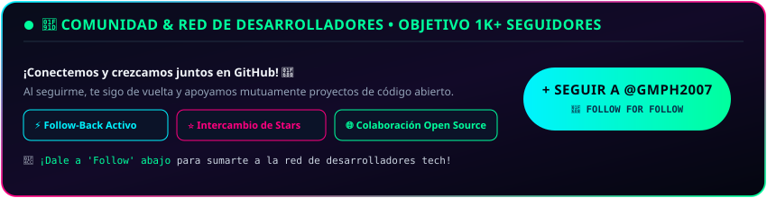
  </a>

<!-- Cyber Terminal Hologram (Click Redirects to Profile) -->

  <a href="https://github.com/GMPH2007">
    
  </a>

<!-- Cyber Divider -->

  

## 🏛️ Hall of Fame &amp; Premios Oficiales • GitHub Legacy Vault

<!-- Hall of Fame (Click Redirects to Official Achievements Tab) -->

  <a href="https://github.com/GMPH2007?tab=achievements">
    
  </a>

  

## 👤 Perfil Profesional • Multilingual Cyber Engineering Profile

  

  <strong>Gerson Misael Pintado Huamán</strong> 
  ⚡ Elite Full-Stack Software Engineer &amp; Cyber Architect • Piura, Perú 🇵🇪

<!-- 🌐 COLLAPSIBLE NATIVE MULTILINGUAL BIOS -->

  
<strong>🇪🇸 Español (Perfil Técnico Principal)</strong>
 
  

    🚀 <strong>Gerson Misael Pintado Huamán</strong> es un desarrollador web Full-Stack y arquitecto de software de Piura, Perú. Con dominio avanzado en <strong>JavaScript moderno, TypeScript, Node.js, Python y PHP/Laravel</strong>, diseña sistemas de alta resiliencia, plataformas de prevención de riesgos con telemetría en tiempo real y suites de automatización con cifrado blindado.
  

  <ul>
    <li>🎯 <strong>Arquitectura Full-Stack:</strong> Interfaces reactivas de alto rendimiento, microservicios y APIs RESTful seguras.</li>
    <li>🔐 <strong>Ciberseguridad &amp; Criptografía:</strong> Autenticación JWT stateless, hashing SHA-256 y protección de endpoints.</li>
    <li>⚡ <strong>Ingeniería en Tiempo Real:</strong> WebSockets, Web Audio API, Canvas interactivo y telemetría IoT.</li>
    <li>📫 <strong>Contacto:</strong> <a href="mailto:misaelpintado7@gmail.com"><code>misaelpintado7@gmail.com</code></a></li>
  </ul>

  
<strong>🇺🇸 English (Elite Technical Profile)</strong>
 
  

    🚀 <strong>Gerson Misael Pintado Huamán</strong> is an Elite Full-Stack Software Engineer &amp; Security Architect based in Piura, Peru 🇵🇪. Specializing in <strong>high-concurrency web systems, real-time IoT telemetry, and cryptographic web defense</strong> across modern JavaScript, TypeScript, Node.js, Python, and Laravel.
  

  <ul>
    <li>🎯 <strong>Core Architecture:</strong> High-performance reactive interfaces, modular microservices &amp; RESTful APIs.</li>
    <li>🔐 <strong>Cyber Defense &amp; Cryptography:</strong> JWT token rotation, SHA-256 HMAC data integrity, and session hardening.</li>
    <li>⚡ <strong>Real-time Telemetry:</strong> WebSockets, Web Audio API engines, Canvas HUD graphics, and disaster forecasting.</li>
    <li>📫 <strong>Direct Inquiries:</strong> <a href="mailto:misaelpintado7@gmail.com"><code>misaelpintado7@gmail.com</code></a></li>
  </ul>

  
<strong>🇧🇷 Português (Perfil Técnico Avançado)</strong>
 
  

    🚀 <strong>Gerson Misael Pintado Huamán</strong> é um Engenheiro de Software Full-Stack e Especialista em Segurança Web no Peru 🇵🇪. Especializado em sistemas resilientes, plataformas de prevenção de desastres com telemetria IoT e automação segura.
  

  <ul>
    <li>🎯 <strong>Stack Principal:</strong> JavaScript, Node.js, Python, PHP/Laravel, MySQL e Cibersegurança.</li>
    <li>🔐 <strong>Segurança:</strong> Criptografia SHA-256, autenticação JWT e arquitetura protegida contra invasões.</li>
    <li>📫 <strong>Contato:</strong> <a href="mailto:misaelpintado7@gmail.com"><code>misaelpintado7@gmail.com</code></a></li>
  </ul>

  
<strong>🇫🇷 Français (Profil d'Ingénierie Logicielle)</strong>
 
  

    🚀 <strong>Gerson Misael Pintado Huamán</strong> est un ingénieur logiciel Full-Stack et architecte en cybersécurité basé au Pérou 🇵🇪. Spécialisé dans le développement d'architectures web robustes, d'intranets de haute performance et de systèmes de télémétrie en temps réel.
  

  <ul>
    <li>🎯 <strong>Technologies Clés:</strong> JavaScript, Node.js, Python, Laravel, Cryptographie SHA-256 et Sécurité JWT.</li>
    <li>📫 <strong>Contact:</strong> <a href="mailto:misaelpintado7@gmail.com"><code>misaelpintado7@gmail.com</code></a></li>
  </ul>

  
<strong>🇩🇪 Deutsch (Technisches Software-Profil)</strong>
 
  

    🚀 <strong>Gerson Misael Pintado Huamán</strong> ist ein Full-Stack-Software-Ingenieur und Web-Sicherheitsarchitekt aus Peru 🇵🇪. Experte für skalierbare Web-Ökosysteme, IoT-Echtzeit-Telemetrie und kryptografisch abgesicherte Systeme.
  

  <ul>
    <li>🎯 <strong>Schwerpunkte:</strong> Full-Stack JavaScript/Node.js, Python, PHP/Laravel, SHA-256/JWT Websicherheit.</li>
    <li>📫 <strong>Kontakt:</strong> <a href="mailto:misaelpintado7@gmail.com"><code>misaelpintado7@gmail.com</code></a></li>
  </ul>

  
<strong>🇯🇵 日本語 (高度な技術プロフィール)</strong>
 
  

    🚀 ペルー在住の高度フルスタックエンジニア兼セキュリティアーキテクト、<strong>ゲルソン・ミサエル・ピンタド・ワマン</strong>。高信頼性リアルタイムWebアーキテクチャ、自然災害防止IoTプラットフォーム「ARGOS」、Stark Tech HUDシステムを構築しています。
  

  <ul>
    <li>🎯 <strong>専門技術:</strong> フルスタック開発 (JS/TS, Node.js, Python, Laravel)、暗号化セキュリティ (SHA-256, JWT)</li>
    <li>📫 <strong>連絡先:</strong> <a href="mailto:misaelpintado7@gmail.com"><code>misaelpintado7@gmail.com</code></a></li>
  </ul>

  
<strong>🇨🇳 中文 (高级软件架构师简介)</strong>
 
  

    🚀 <strong>Gerson Misael Pintado Huamán</strong> 是一名常驻秘鲁的资深全栈软件工程师与网络安全架构师。专注于构建高性能、高可用的实时数字化系统、自然灾害监测平台 (ARGOS) 及自动化脚本套件。
  

  <ul>
    <li>🎯 <strong>核心技术栈:</strong> 全栈开发 (JavaScript, TypeScript, Node.js, Python, Laravel)、网络安全 (SHA-256 加密与 JWT 身份验证)</li>
    <li>📫 <strong>电子邮件:</strong> <a href="mailto:misaelpintado7@gmail.com"><code>misaelpintado7@gmail.com</code></a></li>
  </ul>

  

## 🛠️ Stack Tecnológico & Arsenal Digital • Tech Stack

<!-- Tech Matrix (Click Redirects to Repositories) -->

  

  <strong>🌐 Frontend:</strong>
  
  
  
  
  

  <strong>⚙️ Backend:</strong>
  
  
  
  
  

  <strong>🛡️ Seguridad &amp; Herramientas:</strong>
  
  
  
  
  

  

## 🚀 Proyectos Destacados • Featured Engineering Projects

### 🛡️ 1. ARGOS — Natural Disaster Prevention &amp; Monitoring Platform
> *Sistema de prevención y monitoreo de riesgos naturales con telemetría en tiempo real / Disaster risk management platform with live IoT telemetry.*

  <a href="https://gmph2007.github.io/sistemateos.github.oi/">
    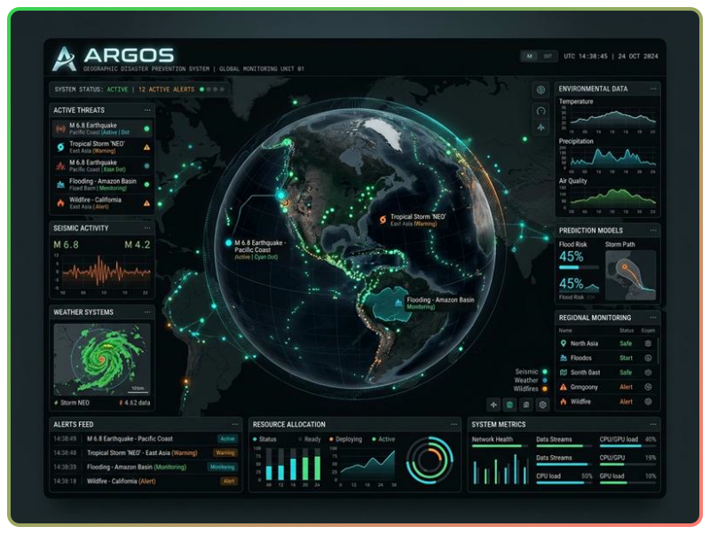
  </a>

  
  

---

### 🏫 2. Intranet &amp; Virtual Classroom I.E. 14739
> *Plataforma escolar integral: control de notas, asistencia y aula virtual / Comprehensive school management & virtual classroom system.*

  <a href="https://colegio14739.freedev.app/">
    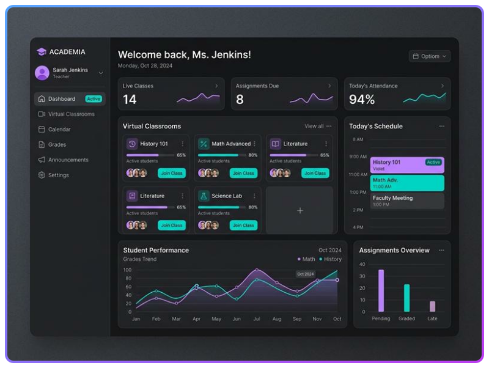
  </a>

  
  

---

### 🕷️ 3. Spidey Tracker Official v30.0
> *Rastreo multiversal Stark Tech, emisora policial Web Audio y minijuego / Multiversal tracking with Stark Tech HUD & Police Radio voice dispatch.*

  <a href="https://github.com/GMPH2007/spidey-tracker-official">
    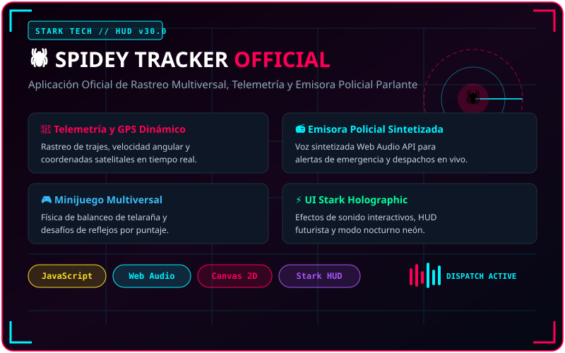
  </a>

  

---

### ⏱️ 4. Chronos — Interactive World Clock
> *Reloj mundial interactivo con mapa de husos horarios y sonido de precisión / Interactive world clock with borders map & acoustic chimes.*

  <a href="https://github.com/GMPH2007/reloj-digital-mundial">
    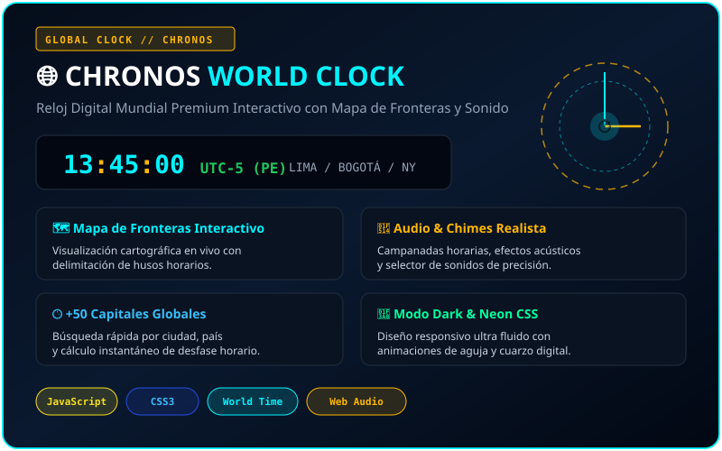
  </a>

  

---

### 🤖 5. Suites de Automatización &amp; Portafolio • Automation Tools

  
  
  

  

## 🐍 Juego de Contribuciones • Contribution Snake

  <i>🎮 La serpiente interactiva recorre y recolecta mis contribuciones en tiempo real:</i>

<!-- Snake (Click Redirects to Profile) -->

  

  

## 📊 Métricas &amp; Telemetría de Rendimiento • Quantum Engine

<!-- Quantum Performance & Telemetry Matrix (Click Redirects to Profile) -->

  <a href="https://github.com/GMPH2007">
    
  </a>

<!-- Live Activity Graph (Click Redirects to Profile) -->

  

<!-- Production Stats Card (Click Redirects to Repositories) -->

  <a href="https://github.com/GMPH2007?tab=repositories">
    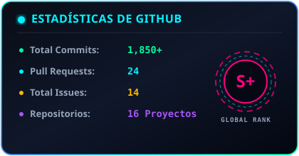
  </a>

<!-- Streak Momentum Card (Click Redirects to Profile) -->

  <a href="https://github.com/GMPH2007">
    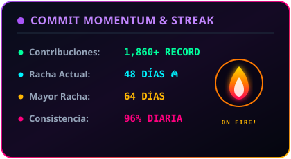
  </a>

<!-- Core Coding Languages Matrix (Click Redirects to Repositories) -->

  <a href="https://github.com/GMPH2007?tab=repositories">
    
  </a>

<!-- Developer Trophies (Click Redirects to Achievements) -->

  <a href="https://github.com/GMPH2007?tab=achievements">
    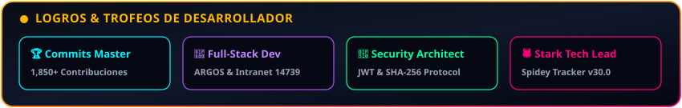
  </a>

  

## 📫 Conéctate Conmigo • Let's Connect!

  ¿Tienes un proyecto en mente, una idea innovadora o buscas colaborar en software de alto impacto? 
  Looking for collaboration, tech partnerships or software development? Let's connect!

  
  
  

<!-- Footer Wave Banner -->

  

  ⚡ Diseñado con pasión y tecnología por <strong>Gerson Misael Pintado Huamán</strong> • Piura, Perú 🇵🇪

