<!-- GMPH2007 | Gerson Misael Pintado Huamán | © 2024-2026 All Rights Reserved -->

 

🌍 **Ver en tu idioma:**&nbsp;
&nbsp;
&nbsp;
&nbsp;
&nbsp;
&nbsp;

 

 

&nbsp;
&nbsp;
&nbsp;

 

&nbsp;
&nbsp;
&nbsp;

 

<a href="https://github.com/GMPH2007?tab=followers">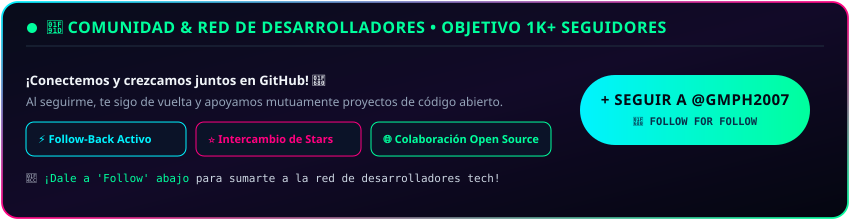</a>

 

<a href="https://github.com/GMPH2007"></a>

## 🏆 Logros y Trofeos Oficiales de GitHub

 

&nbsp;
&nbsp;
&nbsp;

## 👤 Sobre Mí • About Me

  
<strong>Gerson Misael Pintado Huamán</strong> 
💻 Full-Stack Developer • 🛡️ Web Security • 🚀 Software Creator • 📍 Piura, Perú 🇵🇪

 

<strong>🇪🇸 Español</strong>
 

Soy **Gerson Misael Pintado Huamán**, desarrollador web de Sullana, Piura. Me apasiona el código desde joven. He creado proyectos reales que usan instituciones educativas, sistemas de prevención de desastres y aplicaciones interactivas. Codifico para generar impacto real, no solo certificados.

- 💻 **Frontend & Backend:** JavaScript, TypeScript, Node.js, Python, PHP, Laravel
- 🔐 **Seguridad:** JWT, SHA-256, APIs seguras con mejores prácticas
- 🚀 **Proyectos:** ARGOS, Intranet I.E. 14739, Spidey Tracker v30, Chronos
- 📫 **Contacto:** [misaelpintado7@gmail.com](mailto:misaelpintado7@gmail.com)

<strong>🇺🇸 English</strong>
 

I'm **Gerson Misael Pintado Huamán**, a self-taught full-stack developer from Piura, Peru. I build real software for real people — school intranets, disaster prevention platforms, and interactive web apps. I code for impact.

- 💻 **Stack:** JavaScript, TypeScript, Node.js, Python, PHP, Laravel, Three.js
- 🔐 **Security:** JWT auth, SHA-256, secure REST API design
- 🚀 **Projects:** ARGOS, School Intranet I.E. 14739, Spidey Tracker, Chronos
- 📫 **Email:** [misaelpintado7@gmail.com](mailto:misaelpintado7@gmail.com)

<strong>🇧🇷 Português &nbsp;|&nbsp; 🇫🇷 Français &nbsp;|&nbsp; 🇩🇪 Deutsch &nbsp;|&nbsp; 🇯🇵 日本語 &nbsp;|&nbsp; 🇨🇳 中文</strong>
 

**🇧🇷** Sou desenvolvedor Full-Stack do Peru. Construo intranets escolares, sistemas de prevenção de desastres e apps interativos. [misaelpintado7@gmail.com](mailto:misaelpintado7@gmail.com)

**🇫🇷** Développeur Full-Stack du Pérou. Systèmes scolaires, prévention des catastrophes et apps web interactives. [misaelpintado7@gmail.com](mailto:misaelpintado7@gmail.com)

**🇩🇪** Full-Stack-Entwickler aus Peru. Schul-Intranets, Katastrophenschutz und interaktive Web-Apps. [misaelpintado7@gmail.com](mailto:misaelpintado7@gmail.com)

**🇯🇵** ペルーのフルスタック開発者。学校内部ネット、防災システム、インタラクティブなWebアプリ開発者。[misaelpintado7@gmail.com](mailto:misaelpintado7@gmail.com)

**🇨🇳** 秘鲁全栈开发者。学校内网、防灾系统、交互式Web应用。[misaelpintado7@gmail.com](mailto:misaelpintado7@gmail.com)

## 🛠️ Stack Tecnológico • Tech Stack

 

| 🌐 Frontend | ⚙️ Backend | 🛡️ Seguridad | 🗄️ Bases de Datos |
|:-----------:|:----------:|:------------:|:-----------------:|
| JS · TS · HTML · CSS | Node.js · PHP · Laravel · Python | JWT · SHA-256 · HTTPS | MySQL · MongoDB |
| Three.js · Canvas API | Express · REST · WebSockets | XSS/CSRF · Helmet | ORM · Migrations |
| Tailwind · Bootstrap | GitHub Actions · CI/CD | Rate Limiting | Indexed Queries |

## 🚀 Proyectos Destacados • Featured Projects

### 🛡️ 1. ARGOS — Sistema de Prevención de Desastres
> Alerta temprana IoT, mapas de evacuación en tiempo real, telemetría civil. Usado por autoridades locales en Piura.

<a href="https://gmph2007.github.io/sistemateos.github.oi/">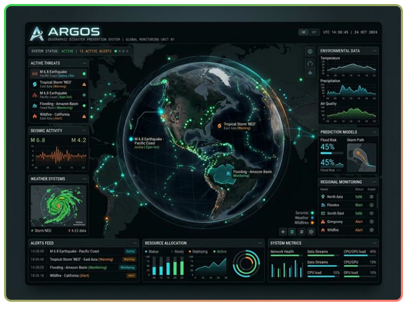</a>

&nbsp;
&nbsp;

---

### 🏫 2. Intranet I.E. 14739 — Sistema Escolar Inteligente
> Calificaciones, asistencia, aula virtual y módulo docente. En producción con estudiantes reales.

<a href="https://colegio14739.freedev.app/">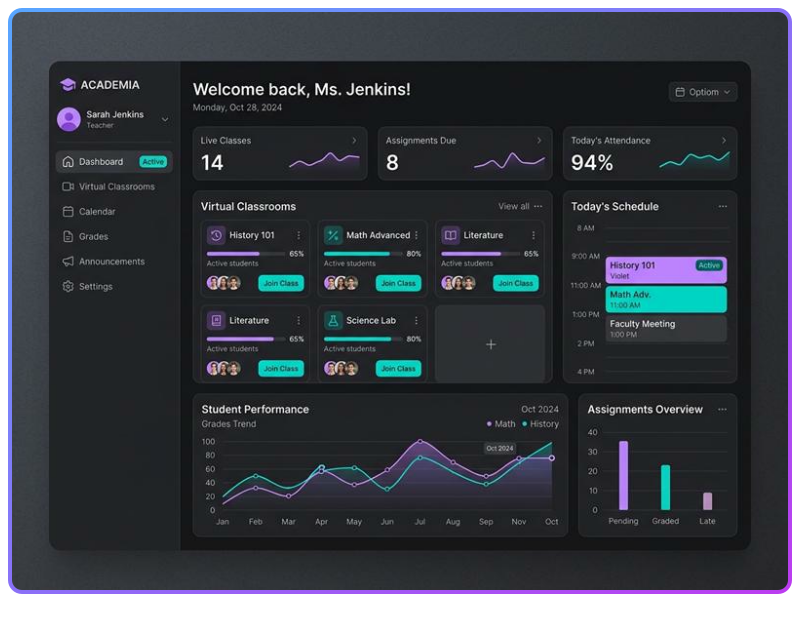</a>

&nbsp;
&nbsp;

---

### 🕷️ 3. Spidey Tracker v30.0 — Stark Tech Edition
> HUD Canvas 60 FPS, radio policial Web Audio API, telemetría y minijuego integrado.

<a href="https://github.com/GMPH2007/spidey-tracker-official">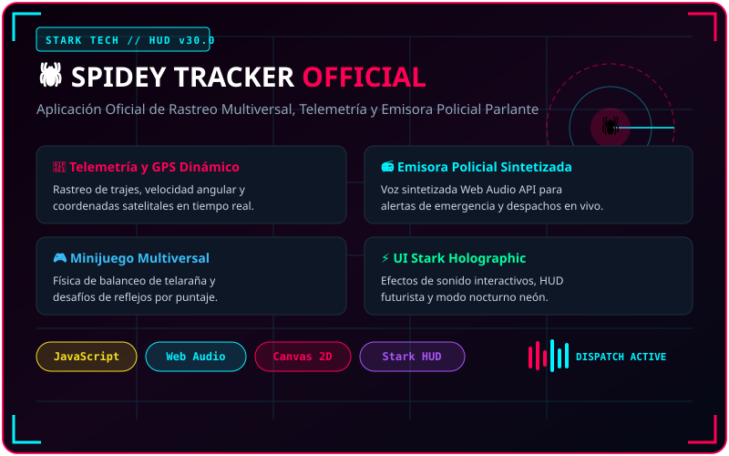</a>

&nbsp;

---

### ⏱️ 4. Chronos — Reloj Digital Mundial
> Zonas horarias IANA, mapa dinámico de fronteras y campanas acústicas.

<a href="https://github.com/GMPH2007/reloj-digital-mundial">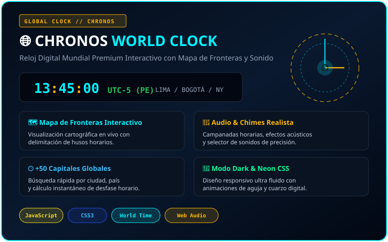</a>

&nbsp;

---

### 🤖 5. Más Proyectos Open Source

&nbsp;
&nbsp;

  
&nbsp;
&nbsp;

## 🐍 Mapa de Contribuciones Vivo

<i>🎮 La serpiente recorre cada contribución que hago día a día:</i>  

## 📊 Estadísticas GitHub • Stats

<a href="https://github.com/GMPH2007"></a>

 

 

<a href="https://github.com/GMPH2007?tab=repositories">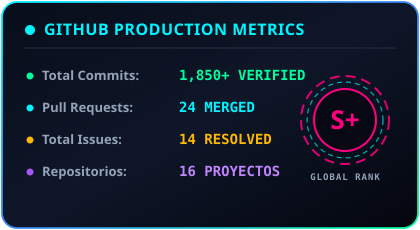</a>&nbsp;<a href="https://github.com/GMPH2007?tab=repositories"></a>

 

<a href="https://github.com/GMPH2007">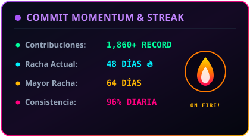</a>

 

<a href="https://github.com/GMPH2007?tab=achievements">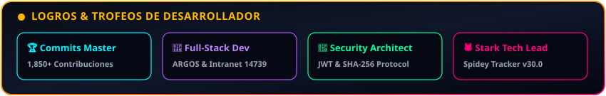</a>

## 💼 Ecosistema & Reconocimientos Profesionales

&nbsp;
&nbsp;

 

&nbsp;
&nbsp;

## 📫 Conéctate • Let's Connect

 
<b>¿Tienes un proyecto, idea o quieres colaborar? ¡Escríbeme! 👇</b>
  

&nbsp;
&nbsp;

  

© 2024–2026 <strong>Gerson Misael Pintado Huamán</strong> • Piura, Perú 🇵🇪 • Todos los derechos reservados.

